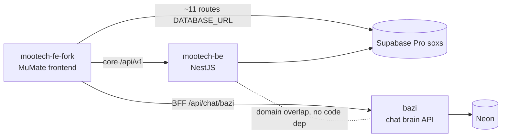

# Project Map: mootech-fe-fork

Updated: 2026-06-19
Grounded from: `README.md`, `package.json`, `pages/`, `components/`, `constants/api/`, `utils/fetch.ts`, `pages/api/auth/[...nextauth].ts`, `middleware.ts`, `.vercel/project.json`, and the 2026-06-19 go-live cutover.

## 0. Current State (2026-06-19)
- **Live domain**: `bazichart.mumate.co` → Vercel project `mootech-fe` (CNAME). Currently serving the **maintenance gate** (`middleware.ts` + `pages/maintenance.tsx`, `MAINTENANCE_MODE=on`); dev bypass via `?bypass=<key>`.
- Backend data now on Supabase **Pro `soxsccdlsycaevusndro`** (behind be); AI chat UI hidden via `NEXT_PUBLIC_ENABLE_CHAT=false`.
- Google/non-LINE login fixed to use stable `providerId` (not OAuth access token).
- Cutover Phase E (flip `NEXTAUTH_URL`→bazichart, close maintenance) pending operator go-ahead.

## 🔗 Cross-Project Relations — "mumate" product group
> Added 2026-06-20. This repo is **1 of 3 sibling repos** behind the MuMate (สายมู/ดวงจีน) product. Use this to orient when work spans repos.

| Repo | Role | Stack / Host | DB |
|------|------|--------------|-----|
| **mootech-fe-fork** (FE) ← *you are here* | Consumer frontend — `bazichart.mumate.co` | Next.js Pages Router · Vercel `mootech-fe` | none of its own; **~11 `/api/*` routes query Supabase Pro `soxs` directly** via `DATABASE_URL` |
| **mootech-be** (BE) | Legacy backend — auth/register-login, horoscope calc, payment, master-data, legacy `ai` chat, LINE multicast | NestJS · Render `srv-d8nc4j8k1i2s73d7e030` | Supabase Pro `soxsccdlsycaevusndro` |
| **bazi** (`bazi-sft-dataset`) | Deterministic Bazi platform — symbolic engine, reading/PDF, **chat brain (API-only, OpenAI-compatible)**, LINE | Next.js App Router · Clerk | Neon (Drizzle) |

### Edges (grounded in code)
- **FE → BE** *(primary)*: all core flows. Base `https://bazichart.mumate.co/api/v1` → BE. Legacy chat = BE `/ai/chat` (gated by `NEXT_PUBLIC_ENABLE_CHAT`).
- **FE → Supabase Pro `soxs`** *(direct)*: FE is **partial-fullstack** — ~11 `/api/*` routes hit the SAME DB as BE via `DATABASE_URL` (drizzle, `lib/db/index.ts`). Cutover must switch BOTH BE (Render) and FE (Vercel) pointers — else split-brain.
- **FE → bazi** *(new chat brain)*: FE BFF [`pages/api/chat/bazi.ts`](pages/api/chat/bazi.ts) → bazi `/api/bazi/calculate` + `/api/v1/chat/completions` (server-side `OPEN_WEBUI_API_TOKEN`, `BAZI_BASE_URL`). UI prototype [`dev-access/bazi-chat-modal.tsx`](dev-access/bazi-chat-modal.tsx) — not yet promoted to prod.
- **bazi ⟂ BE**: no direct code dependency (domain overlap only).

> **This repo = FE.** It is the consumer: calls **BE** for core data, **bazi** for chat, and queries **soxs** directly for ~11 routes.

## 🔒 Collaboration Contract (Human ↔ AI) — ratified 2026-06-19

ข้อตกลง **บังคับ** สำหรับการทำงานร่วมกันหลังระบบ live. AI ต้องปฏิบัติตามทุกข้อ ห้ามข้าม.

### Branch & Deploy
- **Production branch = `feat/fullstack-supabase-fold`** (remote `origin` → github.com/mojisejr/mootech-fe). Deploy = `vercel --prod` (Vercel project `mootech-fe`, manual CLI).
- **ห้าม push ตรงเข้า production branch และห้าม `vercel --prod` เด็ดขาด** จนกว่า: `feature branch → PR → operator review → approve → merge` แล้วเท่านั้น.
- AI **ห้าม** merge PR ของตัวเอง และ **ห้าม** deploy (`vercel --prod`) เองโดยไม่ได้รับ approve.
- Deploy ได้เมื่อ: `npm run build` เขียว **และ** PR merged **และ** operator OK เท่านั้น.
- Follow-up: ตั้ง GitHub branch protection (require PR); พิจารณาเชื่อม Vercel Git auto-deploy + rename → `production`.

### Database (ศักดิ์สิทธิ์ — แตะต้องคุยก่อน)
- repo นี้ **ไม่ได้เป็นเจ้าของ DB** (consumer ผ่าน be API) แต่กฎเดียวกันใช้: การเปลี่ยนแปลงที่กระทบข้อมูล prod (ผ่าน be, migration, query) → **คุย + operator approve ก่อนเสมอ.**
- prod DB = Supabase Pro `soxsccdlsycaevusndro` (เจ้าของ truth = be). ห้าม AI ยิง mutation prod ตรงๆ.

### Ask-First (อะไรเสี่ยง ถามก่อน)
AI ต้องหยุดถาม operator ก่อนทำ: deploy/cutover, เปิด-ปิด maintenance, env/secret changes (Vercel), domain/DNS, OAuth/payment keys, force git ops, ลบไฟล์/ข้อมูล, และ irreversible/outward-facing actions ทุกชนิด.

### Hygiene
- commit แนบ issue id (`#...`) + `Co-Authored-By`; PR body ระบุ **risk + rollback**.
- ห้าม commit `.env*`; rotate secrets ก่อน live; ห้าม echo secret ออก chat.

## 1. Philosophy

`mootech-fe-fork` เป็นเว็บแอปฝั่ง frontend สำหรับประสบการณ์สายมู/ดวงจีนของ MuMate โดยเน้น flow ที่ผู้ใช้ทั่วไปเข้าใช้งานได้ผ่าน social login, อ่านผลดวง/ความสัมพันธ์, ทำแบบสำรวจ, ซื้อแพ็กเกจ, และใช้งาน AI/chat ที่ยิงไปยัง backend กลาง.

แกนสถาปัตยกรรมของโปรเจกต์นี้ไม่ใช่ fullstack monolith แต่เป็น:
- Next.js Pages Router สำหรับ UI และ route บางตัวที่ต้องทำ OAuth callback
- ชุด API wrapper ฝั่ง client ที่ยิงไปยัง backend HTTP เดียว
- NextAuth สำหรับ social authentication หลาย provider
- cookie-based client state สำหรับ member/session metadata ฝั่งหน้าเว็บ

ข้อสังเกตสำคัญ: repo นี้ไม่มี database client, ORM, migration, หรือ schema runtime ของตัวเอง จึงควรมองว่าเป็น consumer ของ backend/API มากกว่าจะเป็น owner ของข้อมูลถาวร.

## 2. Key Landmarks

### App Shell
- `pages/_app.tsx`
  - global app wrapper และ `SessionProvider` ของ NextAuth
- `pages/index.tsx`
  - landing/login orchestration หลักของระบบ, รับ session แล้ว register/login ผ่าน backend
- `pages/login/`, `pages/login-with/`, `pages/register/`
  - entry surfaces สำหรับ auth flow

### Feature Routes
- `pages/my-destiny/`
  - surface อ่านดวง/ผลลัพธ์ส่วนบุคคล
- `pages/matching/`, `pages/matching/recent/`, `pages/matching/result/`
  - flow ดูความเข้ากันได้และประวัติการ matching
- `pages/survey/`
  - แบบสำรวจและการคำนวณผลผ่าน backend
- `pages/chinese-calendar/`, `pages/fortune-stick/`
  - เครื่องมือสายมูและ daily reading surfaces
- `pages/payment/`, `pages/payment/creditcard/`, `pages/payment/qrcode/scan/`, `pages/payment/thankyou/`
  - payment flow ที่ผูกกับ Omise และ backend payment endpoints
- `pages/package-horoscope/`, `pages/package-price/`
  - package catalog / selling surfaces
- `pages/profile/`, `pages/friend/[friend_id]/`, `pages/profile/activity/`, `pages/profile/how-to-earn/`
  - account, referral, friend graph, และ activity surfaces

### Local API / Auth Bridges
- `pages/api/auth/[...nextauth].ts`
  - NextAuth config สำหรับ LINE, Google, Facebook, Twitter
- `pages/api/instagram/callback.ts`
  - server-side Instagram OAuth code exchange + profile fetch
- `pages/auth/after/[provider].tsx`
  - post-auth bridge หลัง callback กลับมาที่หน้าเว็บ

### Data Access Layer
- `constants/api/endpoint.ts`
  - canonical backend base URL และ route registry ของ API ทั้งระบบ
- `constants/api/*.ts`
  - thin request wrappers แยกตาม use case เช่น user, survey, matching, payment, AI, profile
- `utils/fetch.ts`
  - HTTP client utility กลางสำหรับ GET/POST/PUT, upload, และ export file

### UI Composition
- `components/`
  - reusable UI blocks เช่น header, menu, graph, card, survey, payment modal, AI chat modal
- `styles/`
  - styling layer ของโปรเจกต์ (Tailwind config มีอยู่ แต่ component structure ยังพึ่ง page/component CSS patterns แบบดั้งเดิมร่วมด้วย)

## 3. Data Flow

### Core Runtime Flow
User -> Next.js page -> NextAuth / cookies -> `constants/api/*` -> external backend `https://bazichart.mumate.co/api/v1` -> response -> page/component render

### Authentication Flow
1. ผู้ใช้ sign in ผ่าน social providers ที่ NextAuth รองรับ
2. session token/profile ถูกเก็บใน NextAuth session
3. หน้า `pages/index.tsx` และหน้าเกี่ยวข้องอ่าน session แล้วเรียก backend `register_or_login`
4. frontend เก็บ member metadata บางส่วนไว้ใน cookie (`member_id`, `name`, `ref_code`, `image`, `provider`)

### Payment Flow
1. หน้า package/payment เรียก backend เพื่อสร้าง payment intent/charge
2. frontend ใช้ Omise public key สำหรับ payment UI/client bootstrap
3. ผู้ใช้ถูกพาไป authorize URI หรือ QR flow ตามช่องทางชำระเงิน
4. หน้า thank-you/retrieve ยิงกลับไปตรวจสถานะกับ backend

### AI / Fortune Flow
1. ผู้ใช้ trigger feature เช่น fortune stick, AI chat, survey, compatibility
2. page เรียก wrapper ใน `constants/api/`
3. backend เป็นผู้คำนวณ/เก็บข้อมูลจริง แล้วส่งผลลัพธ์กลับมา render ฝั่งหน้าเว็บ

## 4. Database Schema

โปรเจกต์นี้ไม่มี schema หรือ migration ของฐานข้อมูลอยู่ใน repo นี้เอง

- ไม่มี `prisma/`, `drizzle/`, `schema.prisma`, SQL migration, หรือ DB client package
- data persistence ถูกถือครองโดย backend ที่ `constants/api/endpoint.ts` ชี้ไปหา
- ดังนั้น frontend นี้รู้เพียง request/response contracts เชิงพฤตินัยผ่าน `constants/api/*.ts` และ shape ที่แต่ละ page ใช้งาน

ผลคือ ถ้าจะเชื่อม Supabase หรือ Neon จริง มี 2 แนวทาง:
- เชื่อมที่ backend เดิม แล้วให้ frontend ใช้ API เหมือนเดิม
- หรือยกระดับ repo นี้ให้มี BFF / API layer ของตัวเองก่อน แล้วค่อยใส่ DB adapter เข้าไป

## 5. Environment Surfaces

ตัวแปรที่พบจาก config และ route code มีอย่างน้อย:

- App/runtime: `ENVIRONMENT`, `HOST`, `NEXTAUTH_URL`
- Auth: `NEXTAUTH_SECRET`, `LINE_CLIENT_ID`, `LINE_CLIENT_SECRET`, `GOOGLE_CLIENT_ID`, `GOOGLE_CLIENT_SECRET`, `FACEBOOK_CLIENT_ID`, `FACEBOOK_CLIENT_SECRET`, `TWITTER_CLIENT_ID`, `TWITTER_CLIENT_SECRET`
- Marketing/payment: `NEXT_PUBLIC_GTM_ID`, `NEXT_PUBLIC_OMISE_KEY`, `OMISE_PUBLIC_KEY`
- Instagram callback: `IG_CLIENT_ID`, `IG_CLIENT_SECRET`, `IG_REDIRECT_URI`

หมายเหตุ:
- พบ `.env` ถูก commit อยู่ใน repo พร้อม secret จริง ควรถือเป็น security issue
- ควรย้ายเป็น `.env.local` หรือ secret manager และ rotate secrets ก่อนใช้งานจริง

## 6. Challenges

- **Backend Coupling สูง**: base endpoint ถูก hardcode ไปที่ production API ทำให้ local/dev/staging split อ่อน
- **Secrets Exposure**: มี `.env` ที่มี secret จริงอยู่ใน repo
- **No Local Contract Layer**: ไม่มี schema validation ระดับ boundary ทำให้ request/response drift ตรวจจับยาก
- **Pages Router Legacy Shape**: หลายหน้าใหญ่และมี logic orchestration อยู่ใน page component โดยตรง ทำให้ maintain ยากเมื่อฟีเจอร์โต
- **Cookie + Session Dual State**: ใช้ทั้ง NextAuth session และ cookies ฝั่ง app พร้อมกัน จึงเสี่ยง state mismatch
- **Database Ownership ไม่ชัดใน Repo**: หากจะต่อ Supabase/Neon ต้องตัดสินใจก่อนว่า DB จะอยู่หลัง backend เดิม หรือ frontend repo นี้จะกลายเป็น fullstack owner